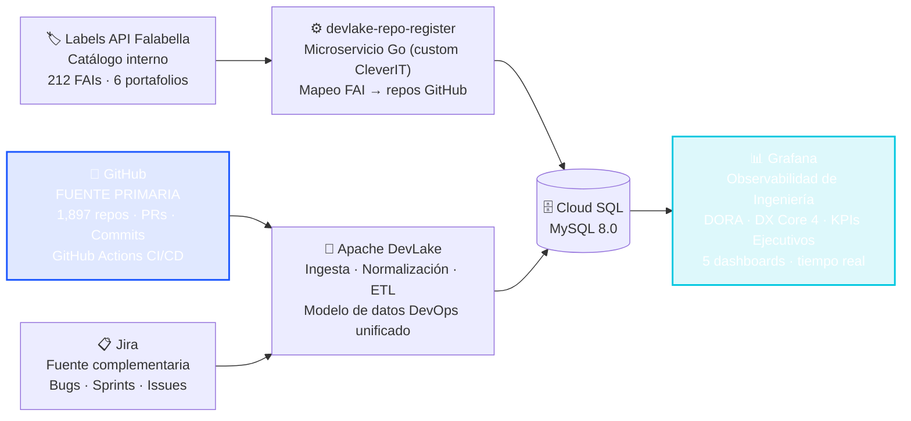

Caso de Éxito · Observabilidad de Ingeniería · 2025–2026

De cero observabilidad a métricas de ingeniería en tiempo real

Cómo GitHub + DORA + DX Core 4 le dieron visibilidad completa a los equipos de desarrollo de uno de los mayores ecosistemas tecnológicos de Latam

  
<strong>CleverIT</strong>

  
× <strong>Falabella Retail</strong>

  
GitHub · DORA · DX Core 4 · Grafana

---

## El Problema: Sin Observabilidad de Ingeniería

  

    
🔍

    
1,897

    
Repositorios. Ninguno con métricas.

    
Todo el código de Falabella estaba en GitHub — PRs, commits, pipelines CI/CD — pero nadie lo medía. Los datos existían. La observabilidad, no.

  

  

    
🗂️

    
212

    
Aplicaciones sin visibilidad de ingeniería.

    
6 portafolios de negocio activos. Ningún líder podía responder cuánto tardaba un cambio en llegar a producción, ni qué equipo era más ágil.

  

  

    
🤖

    
56%

    
Del ruido era invisible para todos.

    
Más de la mitad de los PRs eran de bots (Dependabot). Sin filtros de calidad, cualquier intento de medir era medir ruido, no trabajo humano real.

  

---

## GitHub: La Fuente de Verdad de Ingeniería

Todo lo que necesitábamos para dar observabilidad ya estaba ahí — en GitHub. Solo hacía falta conectarlo.

  

    
🐙

    
GitHub ya tenía todo

    

      
1,897 repositorios con historial completo

      
Todos los Pull Requests y sus timestamps

      
Cada commit con autor y fecha

      
87,000+ pipelines de GitHub Actions

      
Ramas de producción (main / master)

    

  

  
→

  

    
Lo que eso permite medir

    

      DORA
      Lead Time: primer commit → merge a prod
    

    

      DORA
      Deployment Frequency por equipo/portafolio
    

    

      DORA
      Change Failure Rate en ramas productivas
    

    

      DX Core 4
      Coding Time: commit → apertura del PR
    

    

      DX Core 4
      PR Review Time y Batch Size
    

    

      DX Core 4
      Build Time, Queue Time y Burnout Risk
    

  

  💡 <strong>Sin instrumentar una sola línea de código.</strong> La observabilidad de ingeniería vive en los datos que GitHub ya captura.

---

## La Arquitectura: GitHub en el Centro

GitHub como fuente primaria. DevLake como motor de normalización. Grafana como capa de observabilidad.

  GitHub aporta >90% de los datos de ingeniería. Jira aporta contexto de calidad. La Labels API permite atribuir métricas al portafolio de negocio correcto.

---
layout: center
---

  
La Escala

  
Todo vive en GitHub. Ahora también se ve.

  

    
1,897

    
Repositorios GitHub con observabilidad

    
94.8% con FAI de negocio mapeado

  

  

    
87K+

    
Pipelines CI/CD analizados

    
GitHub Actions · ramas productivas

  

  

    
9,520

    
PRs humanos reales medidos

    
Filtro anti-bot aplicado en 35 paneles

  

  

    
212

    
Aplicaciones con métricas asignadas

    
6 portafolios · visibilidad por FAI

  

  

    
4

    
Métricas DORA activas

    
Lead Time · DF · CFR · DSR

  

  

    
4

    
Pilares DX Core 4

    
Velocidad · Calidad · CI/CD · Bienestar

  

  

    
5

    
Dashboards en producción 24/7

    
Grafana · tiempo real

  

---

## DORA — Observabilidad de Entrega de Software

DORA convierte los datos de GitHub en señales claras sobre la capacidad de entrega de cada equipo.

  

    
⚡ Velocidad

    
Lead Time for Changes

    
¿Cuánto tarda una idea en llegar a producción? Se mide directo en GitHub: primer commit → merge a main. Sin supuestos.

    
✓ Activo · fuente: GitHub

  

  

    
🚀 Frecuencia

    
Deployment Frequency

    
¿Con qué frecuencia despliega cada equipo? GitHub Actions registra cada pipeline exitoso en ramas de producción.

    
✓ Activo · fuente: GitHub Actions

  

  

    
🛡️ Estabilidad

    
Change Failure Rate

    
% de deployments fallidos vs exitosos. Filtrado solo a ramas productivas vía GitHub Actions. CFR + DSR = 100% siempre.

    
✓ Activo · fuente: GitHub Actions

  

  

    
🔄 Recuperación

    
MTTR — Time to Recover

    
Tiempo de restauración tras incidente. Proxy activo vía Jira. MTTR real: pendiente integración con datos SRE (Splunk).

    
⏳ En progreso

  

---

## DX Core 4 — Observabilidad del Desarrollador

DX Core 4 mide lo que DORA no ve: el día a día del desarrollador. Todo extraído de GitHub.

  

    
P1

    
Velocidad

    <ul class="dx-items">
      <li>Coding Time (commit → PR)</li>
      <li>PR Review Time (apertura → merge)</li>
      <li>Batch Size (commits por PR)</li>
    </ul>
    
→ fuente: GitHub PRs & commits

  

  

    
P2

    
Calidad

    <ul class="dx-items">
      <li>Tasa de retrabajo (PRs cerrados sin merge)</li>
      <li>Bugs Jira por proyecto</li>
      <li>PRs rechazados</li>
    </ul>
    
→ fuente: GitHub PRs + Jira

  

  

    
P3

    
Eficiencia CI/CD

    <ul class="dx-items">
      <li>Build Time (pipelines exitosos)</li>
      <li>Queue Time (creación → inicio)</li>
      <li>Tendencias históricas</li>
    </ul>
    
→ fuente: GitHub Actions

  

  

    
P4

    
Bienestar

    <ul class="dx-items">
      <li>Burnout Risk</li>
      <li>Commits fines de semana</li>
      <li>Tendencia mensual</li>
    </ul>
    
→ fuente: GitHub commits

  

  12+ métricas activas · 100% extraídas de datos que GitHub ya captura · cero instrumentación adicional

---

## Calidad de Datos: El Problema de los Bots

Sin filtros de calidad, las métricas de equipo eran estadísticas de bots, no de personas.

  

    
Antes del filtro

    
56%

    
de los PRs en GitHub

    
eran de <strong style="color:var(--cl-red)">Dependabot</strong> (bot de dependencias)  12,153 de 21,673 PRs 11,407 commits de bots  <em>DORA inflado · DX Core 4 sin sentido</em>

  

  
→

  

    
Después del filtro

    
0%

    
ruido de bots

    
Filtro <code style="font-size:0.75rem; background:rgba(32,227,160,0.1); padding:2px 6px; border-radius:4px">head_ref NOT LIKE 'dependabot/%'</code> en <strong style="color:var(--cl-green)">35 paneles</strong>  9,520 PRs humanos reales DORA y DX Core 4 confiables  <em>Calidad de datos = observabilidad real</em>

  

---

## 5 Dashboards de Observabilidad en Producción

  

    
🏠

    

      
Portal de Inicio

      
Navegación central · 6 métricas en tiempo real: repos activos, FAIs mapeados, PRs humanos, pipelines GitHub Actions

    

    
Todos

  

  

    
📊

    

      
Métricas DORA

      
Lead Time · Deployment Frequency · CFR · DSR · Pipeline Duration · PR Review Time — por FAI y portafolio

    

    
Tech Leads

  

  

    
💡

    

      
DX Core 4

      
Velocidad del dev · Calidad del código · Eficiencia CI/CD · Bienestar del equipo — todo desde GitHub

    

    
Eng. Managers

  

  

    
🔍

    

      
Detalle Coding

      
Análisis granular de Coding Time, distribución de commits por PR y tendencias semanales por equipo

    

    
Tech Leads

  

  

    
🎯

    

      
Vista Ejecutiva KPIs

      
Panel consolidado con drill-down a DORA, DX Core 4 y Coding Detail. Filtros preservados entre dashboards.

    

    
CTO · VPs

  

---
layout: center
---

  
Resultados

  
La observabilidad de ingeniería que Falabella tiene hoy

  

    
✓

    
<strong>Observabilidad completa desde GitHub</strong>: 1,897 repos, 212 apps y 87K+ pipelines con métricas en tiempo real.

  

  

    
✓

    
<strong>DORA y DX Core 4 activos</strong> por equipo, FAI y portafolio — drill-down desde la vista ejecutiva hasta el repo.

  

  

    
✓

    
<strong>Señal limpia, no ruido</strong>: filtros anti-bot en 35 paneles. DORA y DX Core 4 reflejan trabajo humano real.

  

  

    
✓

    
<strong>Cero instrumentación de código</strong>: toda la observabilidad se extrae de los datos que GitHub ya captura.

  

  

    
✓

    
<strong>Integración automática</strong>: el microservicio Go sincroniza repos nuevos de GitHub sin intervención manual.

  

  

    
✓

    
<strong>Capacidad instalada</strong>: el equipo de Falabella opera autónomamente con documentación y runbooks completos.

  

