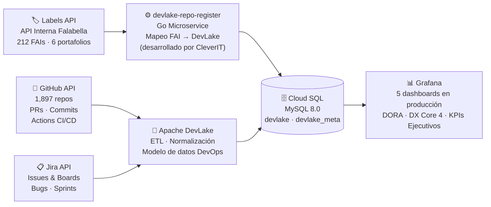

Caso de Éxito · 2025–2026

De datos dispersos a inteligencia DevOps en tiempo real

Plataforma DevOps Intelligence para uno de los mayores ecosistemas de desarrollo tecnológico de Latinoamérica

  
<strong>CleverIT</strong>

  
× <strong>Falabella Retail</strong>

  
GKE · DevLake · Grafana · Go

---

## El Desafío

  

    
🔍

    
1,897

    
Repositorios. Cero visibilidad unificada.

    
Datos de GitHub, Jira y pipelines CI/CD en silos. Sin una capa que los cruzara ni los interpretara.

  

  

    
🗂️

    
212

    
Aplicaciones sin métricas de ingeniería.

    
6 portafolios de negocio. Ningún líder podía responder cuánto tardaba un cambio en llegar a producción.

  

  

    
🤖

    
56%

    
Del ruido era invisible para todos.

    
Más de la mitad de los PRs eran generados por bots (Dependabot), contaminando cualquier métrica de equipo.

  

---

## La Arquitectura

Un pipeline de datos unificado — de 3 fuentes dispersas a 5 dashboards en producción.

  💡 El servicio Go custom fue la clave — sin él, los 1,897 repos no tendrían dueño de negocio asignado.

---
layout: center
---

  
La Escala del Proyecto

  
Números que hablan solos

  

    
1,897

    
Repositorios GitHub monitoreados

    
94.8% con FAI mapeado

  

  

    
212

    
Aplicaciones en catálogo

    
6 portafolios de negocio

  

  

    
5

    
Dashboards en producción

    
Disponibles 24/7

  

  

    
35

    
Paneles con calidad de datos

    
Filtros anti-bot aplicados

  

  

    
87K

    
Pipelines CI/CD totales

    
26,972 en ramas productivas

  

  

    
4

    
Métricas DORA activas

    
Lead Time · DF · CFR · DSR

  

  

    
4

    
Pilares DX Core 4

    
Velocidad · Calidad · CI/CD · Bienestar

  

---

## Framework DORA — Métricas de Ingeniería

Estándar Google DORA para medir la capacidad de entrega de software de los equipos.

  

    
⚡ Velocidad

    
Lead Time for Changes

    
Tiempo real desde el primer commit hasta merge a producción. Mide la agilidad del equipo para entregar valor.

    
✓ Activo

  

  

    
🚀 Frecuencia

    
Deployment Frequency

    
¿Con qué frecuencia el equipo despliega a producción? Normalizado por célula y portafolio para comparación justa.

    
✓ Activo

  

  

    
🛡️ Estabilidad

    
Change Failure Rate

    
% de deployments que terminan en fallo. Solo ramas de producción (main/master). CFR + DSR = 100% siempre.

    
✓ Activo

  

  

    
🔄 Recuperación

    
MTTR — Time to Recover

    
Tiempo medio de restauración del servicio tras un incidente. Proxy activo via Jira. MTTR real pendiente integración SRE.

    
⏳ En progreso

  

---

## DX Core 4 — Experiencia del Desarrollador

Framework complementario que mide el impacto del entorno de trabajo en la productividad y bienestar del equipo.

  

    
P1

    
Velocidad

    <ul class="dx-items">
      <li>Coding Time</li>
      <li>PR Review Time</li>
      <li>Batch Size</li>
    </ul>
  

  

    
P2

    
Calidad

    <ul class="dx-items">
      <li>Tasa de retrabajo</li>
      <li>Bugs Jira por proyecto</li>
      <li>PRs rechazados</li>
    </ul>
  

  

    
P3

    
Eficiencia CI/CD

    <ul class="dx-items">
      <li>Build Time (éxitos)</li>
      <li>Queue Time</li>
      <li>Tendencias históricas</li>
    </ul>
  

  

    
P4

    
Bienestar

    <ul class="dx-items">
      <li>Burnout Risk</li>
      <li>Commits fines de semana</li>
      <li>Tendencia mensual</li>
    </ul>
  

  4 pilares · 12+ métricas activas · Datos en tiempo real desde GitHub y Jira

---

## El Problema de los Bots — Calidad de Datos

Sin filtros de calidad, las métricas de equipo eran estadísticas de bots, no de personas.

  

    
Antes del filtro

    
56%

    
de los PRs

    
eran de <strong style="color:var(--cl-red)">Dependabot</strong> (bot de dependencias)  12,153 de 21,673 PRs 11,407 commits de bots  <em>Métricas de velocidad infladas artificialmente</em>

  

  
→

  

    
Después del filtro

    
0%

    
ruido de bots

    
Filtro <code style="font-size:0.75rem; background:rgba(32,227,160,0.1); padding:2px 6px; border-radius:4px">head_ref NOT LIKE 'dependabot/%'</code> en <strong style="color:var(--cl-green)">35 paneles</strong>  9,520 PRs humanos reales Métricas confiables para decisiones  <em>Calidad de datos = calidad de decisiones</em>

  

---

## 5 Dashboards en Producción

  

    
🏠

    

      
Portal de Inicio

      
Navegación central con 6 métricas en tiempo real de la plataforma: repos activos, FAIs mapeados, PRs humanos y pipelines

    

    
Todos los usuarios

  

  

    
📊

    

      
Métricas DORA

      
Lead Time · Deployment Frequency · Change Failure Rate · DSR · Pipeline Duration · PR Review Time

    

    
Líderes técnicos

  

  

    
💡

    

      
DX Core 4

      
4 pilares: Velocidad del dev · Calidad del código · Eficiencia CI/CD · Bienestar del equipo

    

    
Engineering Managers

  

  

    
🔍

    

      
Detalle Coding

      
Análisis granular: Coding Time por FAI, distribución de commits por PR, tendencias semanales

    

    
Tech Leads

  

  

    
🎯

    

      
Vista Ejecutiva KPIs

      
Panel ejecutivo consolidado. Navegación cruzada a DORA, DX Core 4 y Detalle Coding con filtros preservados

    

    
CTO · VPs

  

---

## Stack Tecnológico

Tecnología open source enterprise-grade, desplegada en Google Cloud.

  

    
🔧

    

      
Apache DevLake

      
Motor de ingesta y normalización de datos DevOps

    

  

  

    
📊

    

      
Grafana (custom image)

      
Visualización · Dashboards · Executive view

    

  

  

    
☸️

    

      
GKE Autopilot

      
Orquestación serverless en Google Cloud

    

  

  

    
🗄️

    

      
Cloud SQL (MySQL 8.0)

      
Base de datos gestionada · Alta disponibilidad

    

  

  

    
⚙️

    

      
Go Microservice (custom)

      
Puente Labels API ↔ DevLake — desarrollado por CleverIT

    

  

  

    
📦

    

      
Kubernetes ConfigMaps

      
Aprovisionamiento declarativo · Zero downtime

    

  

  

    
🐙

    

      
GitHub API

      
Source: repos · PRs · commits · GitHub Actions

    

  

  

    
📋

    

      
Jira API

      
Source: issues · bugs · sprints · boards

    

  

  

    
🔐

    

      
Keycloak / OIDC

      
SSO corporativo · Control de acceso por rol

    

  

---
layout: center
---

  
Resultados

  
Lo que Falabella tiene hoy que no tenía antes

  

    
✓

    
<strong>Visibilidad en tiempo real</strong> de 1,897 repositorios, 212 apps y 6 portafolios desde un único portal.

  

  

    
✓

    
<strong>Métricas DORA + DX Core 4</strong> disponibles por equipo, FAI y portafolio — con drill-down desde la vista ejecutiva.

  

  

    
✓

    
<strong>Datos de ingeniería confiables</strong>: filtros anti-bot en 35 paneles. Las métricas reflejan trabajo humano real.

  

  

    
✓

    
<strong>Integración automática de repos</strong>: el servicio Go custom sincroniza repositorios nuevos sin intervención manual.

  

  

    
✓

    
<strong>Infraestructura resiliente</strong>: dashboards persisten entre reinicios via Kubernetes ConfigMaps. Zero downtime.

  

  

    
✓

    
<strong>Capacidad instalada</strong>: el equipo de Falabella (Juan Cuzmar) toma ownership completo con documentación y runbooks.

  

